# Unit 21 - Blockchain Advanced Solidity

## Resources
[Remix IDE](https://remix.ethereum.org) is used to create the `Crowdsale` contracts 
[Ganache](https://www.trufflesuite.com/ganache) development chain is used to connect to MetaMask `localhost:8545` and `Kovan testnet` 
[MyCrypto](https://download.mycrypto.com/) used in this assignment to add and test the token 

 

## Creating a Crowdsale Contract
A `Crowdsale` contract is created using the OpenZeppelin Solidity library to send Ether and get back `PupperCoin` tokens.  The contract mints PupperCoin (an ERC20 token) to distribute to buyers in one transaction using a standard `ERC20Mintable` and `ERC20Detailed` contract.  The body of the constructor remains empty as the logic for the contract will inherit `Crowdsale`, `MintedCrowdsale`, `CappedCrowdsale`, `TimedCrowdsale`, `RefundableCrowdsale`.  The `PupperCoinSale` contract is set as a minter and then renounced. 

After compiling the contract, the crowdsale is tested.

**PupperCoin contract compiled**

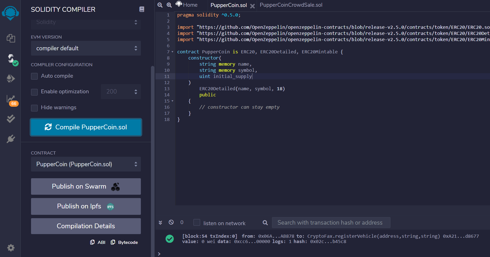

**PupperCoinSale contract compiled**

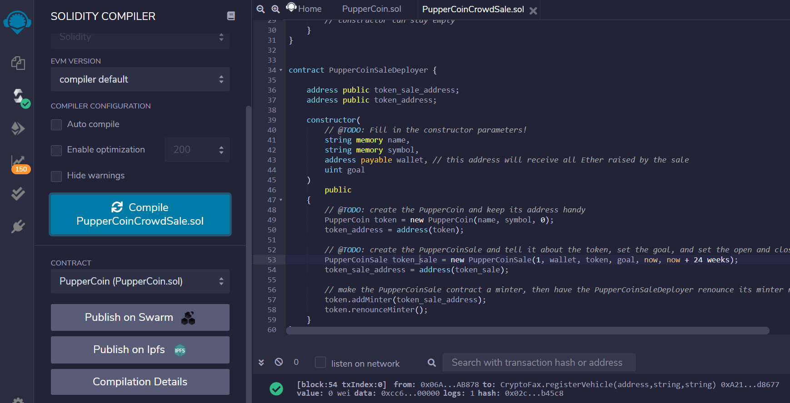

## Testing the Crowdsale

Ganache and Metamask are used to test the `PupperCoinSale` and `PupperCoin` contracts.  The contract passes in the parameters for the `name` and `symbol` variables and passes in `0` as the initial supply.  The `PupperCoinSaleDeployer` function stores the address of the `PupperCoin` and `PupperCoinSale` contracts that are used to deploy the contract.  The `PupperCoinSale` contract `rate` parameter is hardcoded to `1`, `wallet` will pass from the main constructor and will be paid the Ether raised by `PupperCoinSale`, `token` is from the token variable stored in `PupperCoin`, the `open` time is set to `now` and the `close` time is set to `now + 24 weeks`, but was tested using `open` set to `fakenow` and `close` set to `now + 5 minutes`.

**PupperCoinSale Deployed**

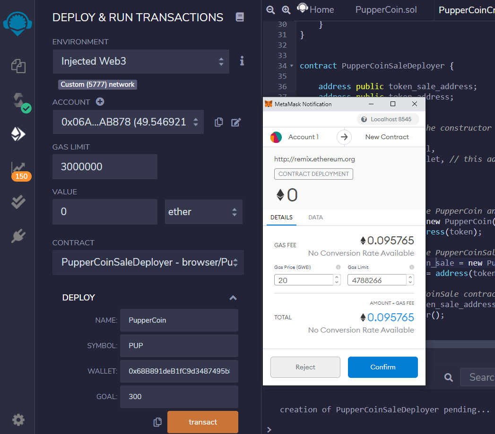

**PupperCoin and PupperCoinSale token addresses**

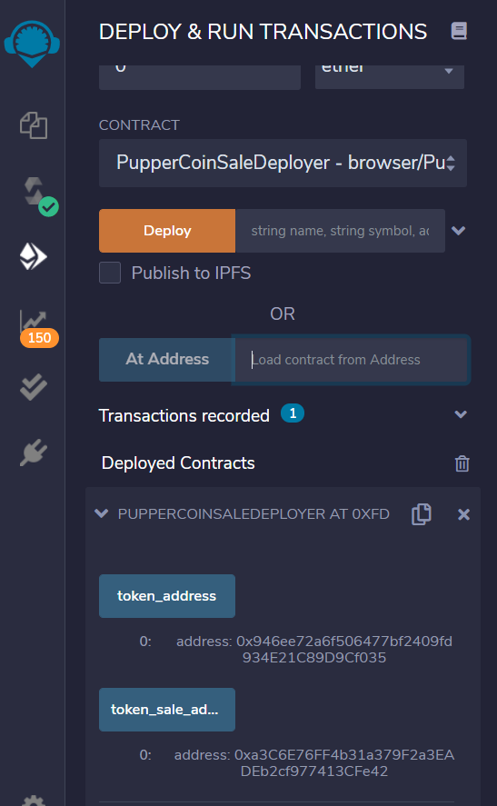

The `PupperCoinSale` contract is deployed using the `PupperCoinSale` token address:

The `PupperCoin` contract is deployed using the `PupperCoin` token address and parameters `name`, `symbol` and `initial_supply`:

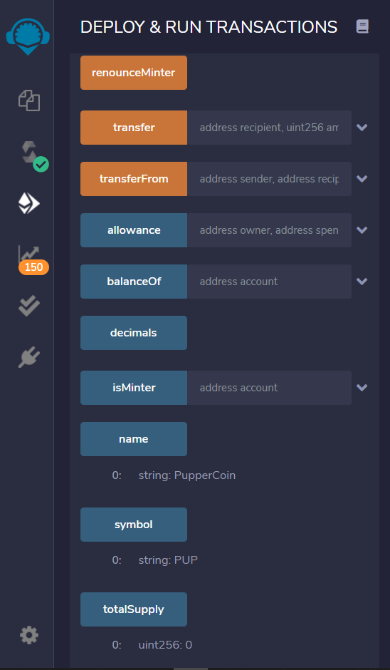

The `PupperCoin` token is added in MyCrypto:

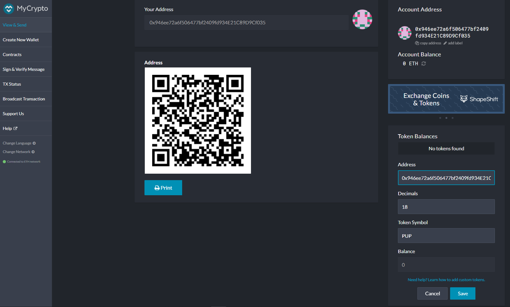

## Testing the Crowdsale: Kovan Testnet
Ganache and Metamask are also used to test the `PupperCoin` and `PupperCoinSale` contracts using the Kovan testnet to send Ether.

**PupperCoinSale Deployed on Kovan Testnet**

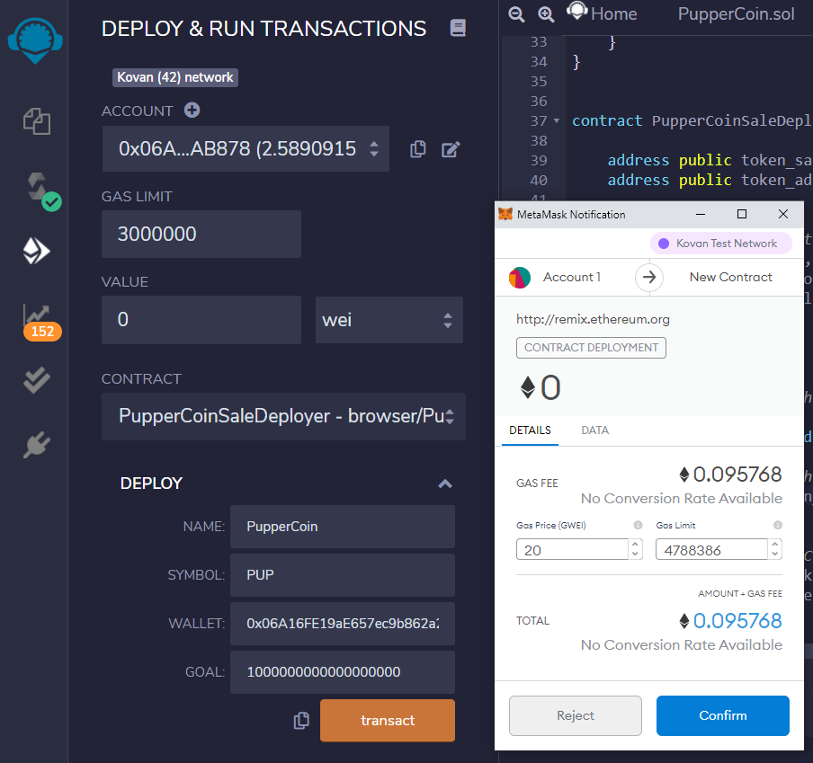

**PupperCoin and PupperCoinSale token addresses**

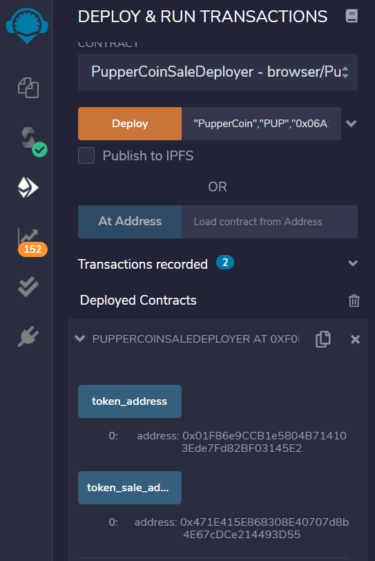

The `PupperCoinSale` contract is deployed using the `PupperCoinSale` token address:

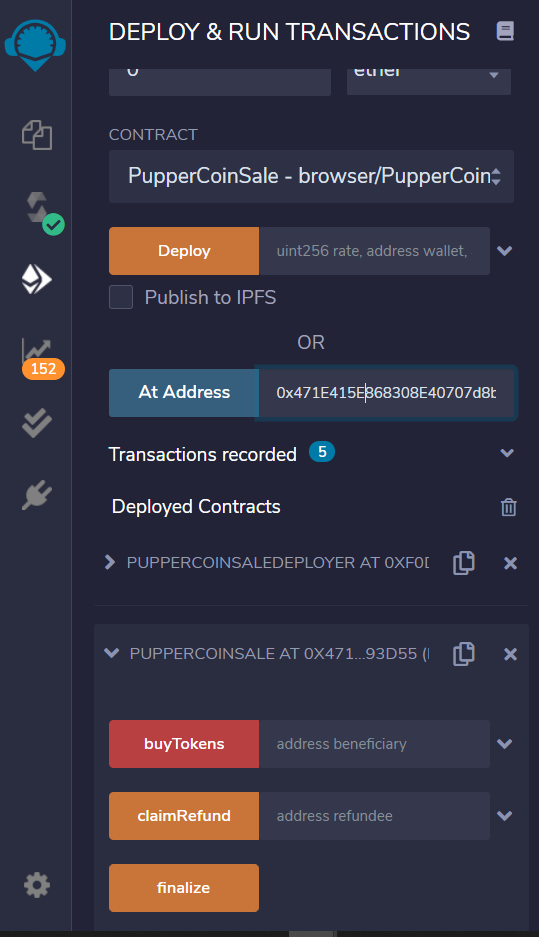

The `PupperCoin` contract is deployed using the `PupperCoin` token address and parameters `name`: PupperCoin, `symbol`: PUP and `initial_supply`: 1000000000000000000:

The `PupperCoinSale` contract is used to buy PupperCoin token:

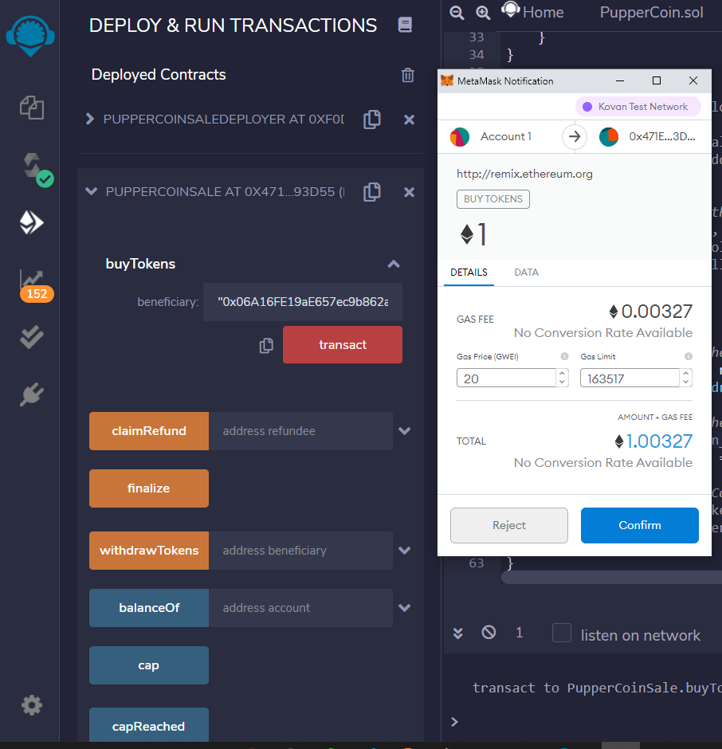

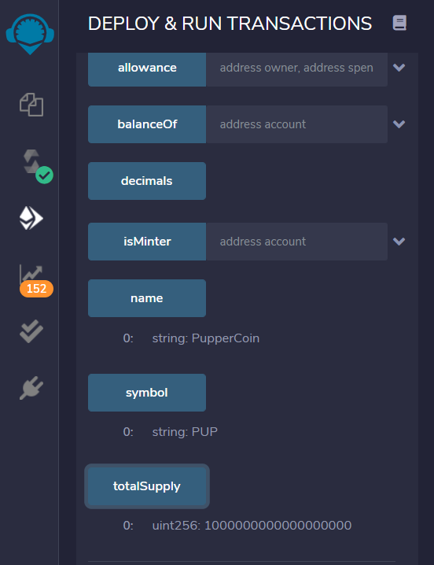

**PupperCoin token added to Metamask**

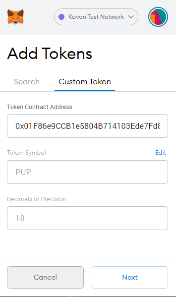
